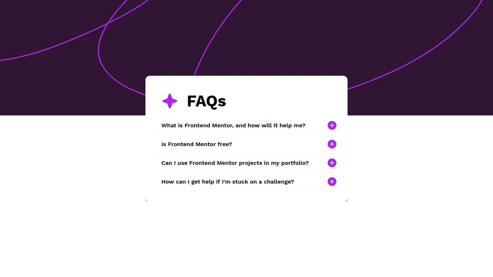

# Frontend Mentor - FAQ accordion solution

This is a solution to the [FAQ accordion challenge on Frontend Mentor](https://www.frontendmentor.io/challenges/faq-accordion-wyfFdeBwBz). Frontend Mentor challenges help you improve your coding skills by building realistic projects. 

## Table of contents

- [Overview](#overview)
  - [The challenge](#the-challenge)
  - [Screenshot](#screenshot)
  - [Links](#links)
- [My process](#my-process)
  - [Built with](#built-with)
  - [What I learned](#what-i-learned)
  - [Continued development](#continued-development)
- [Author](#author)

## Overview

### The challenge

Users should be able to:

- Hide/Show the answer to a question when the question is clicked
- Navigate the questions and hide/show answers using keyboard navigation alone
- View the optimal layout for the interface depending on their device's screen size
- See hover and focus states for all interactive elements on the page

### Screenshot

### Links

- Solution URL: [Github Solution](https://github.com/PedroReves/Faq-Page)
- Live Site URL: [Live Solution](https://pedroreves.github.io/Faq-Page/)

## My process

### Built with

- Semantic HTML5 markup
- CSS custom properties
- Flexbox

### What I learned

I learned more about javascript and how to modify the dom, and how to interact with more than one item using only javascript, i learned more about states, and how can i modify something on my website based on a condition;

### Continued development

I want to improve more the responsiveness of this website, because i felt this website a little messy on mobile devices, i think i can refactor my javascript to be more simple, but in gerenal, the design is great.

## Author

- Frontend Mentor - [@PedroReves](https://www.frontendmentor.io/profile/PedroReves)
